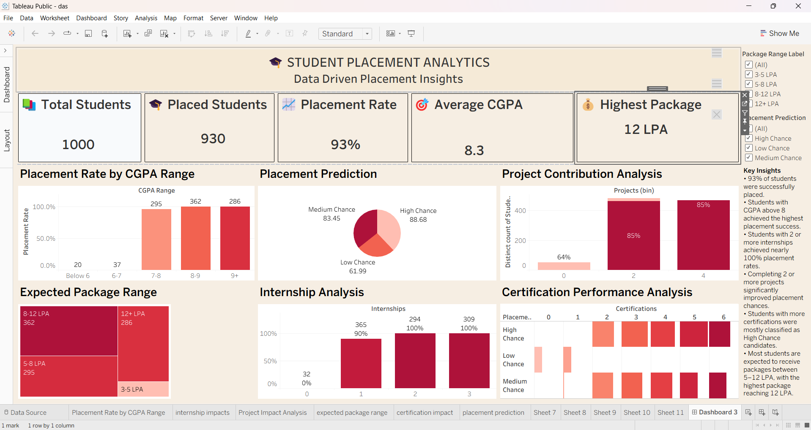

# 🎓 Student Placement Analytics Dashboard

## 📌 Overview

This project is an interactive Tableau dashboard designed to analyze student placement data. It provides insights into placement trends, salary distribution, skill impact, and academic performance to help identify key factors influencing placements.

---

## 🚀 Features

- Placement Rate Analysis
- Average Package
- Highest Package
- Branch-wise Placement
- Salary Distribution
- Skill Impact Analysis
- Academic Performance Analysis
- Interactive Filters and KPIs

---

## 🛠 Tools & Technologies

- Tableau
- Microsoft Excel
- SQL
- Data Visualization

---

## 📂 Dataset

The project uses a student placement dataset containing academic performance, skills, internships, certifications, and placement details.

---

## 📸 Dashboard Preview

---

## 📈 Key Insights

- Compared placement performance across branches.
- Identified the impact of internships and certifications on placements.
- Analyzed salary distributions.
- Built interactive dashboards using KPIs and filters.

---

## 👩‍💻 Author

Lakshmi Sindhuja

LinkedIn:
https://www.linkedin.com/in/pentakota-lakshmi-sindhuja-750b65382

GitHub:
https://github.com/sindhu0618
